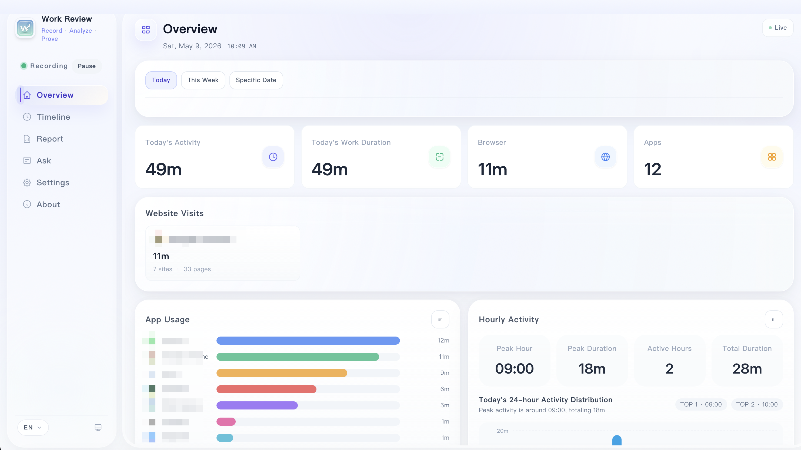
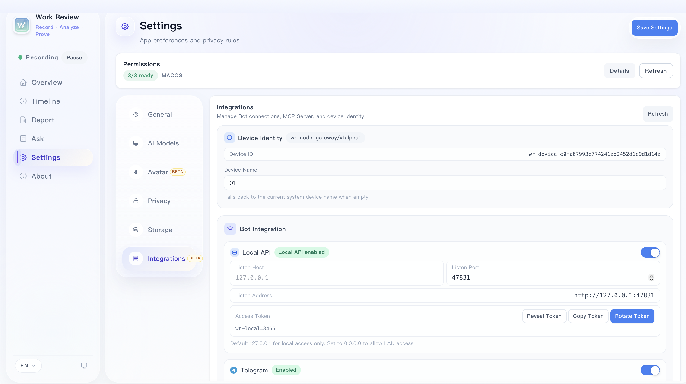

<p align="center">
  
</p>

<h1 align="center">Work Review</h1>

<p align="center">
  <strong>A local-first work activity recorder for individuals.</strong>
</p>

<p align="center">
  <a href="./README.md">简体中文</a> · <a href="./README.tw.md">繁體中文</a> · <a href="./README.en.md">English</a>
</p>

<p align="center">
  <a href="https://github.com/wm94i/Work_Review/releases/latest">
    
  </a>
  
  
  
</p>

---

Work Review continuously records the apps you use, websites you visit, active windows, and screen context during the day, then turns those fragments into a **reviewable, queryable, and reusable** work trail.

- No manual check-ins — just look back at what actually happened
- Overview, timeline, daily report, and assistant all share the same local data
- Jump from aggregate stats to concrete pages, titles, and screenshots
- Multi-segment work time, per-domain semantic tagging, and hourly activity views
- Lightweight mode, Markdown report export, and multi-display screenshot strategies
- `Desktop Avatar Beta` — lightweight desktop companion for presence feedback while you work

> All data stays local by default. AI features are optional.

---

## What It Is

This is not a traditional attendance app, and not just another dashboard that piles up time numbers.

Work Review is closer to a personal work-trace system:

- Capture work context automatically: apps, websites, screenshots, OCR text, and hourly summaries
- Answer practical questions: “What did I do today?” or “What has been the main focus this week?”
- Designed for recall and review, not surveillance

---

## Core Capabilities

### Automatic Tracking

| Dimension | Description |
|---------|------|
| App tracking | Detects the foreground app and records duration, titles, and categories |
| Website tracking | Captures browser URLs and aggregates by browser, domain, and page |
| Screen trail | Takes screenshots, extracts OCR text, and supports active-display or full-desktop capture |
| Idle detection | Uses both input and screen changes to reduce false working time |
| Historical replay | Reconstructs the day through a timeline with context |

### Analysis

| Capability | Description |
|-----|------|
| Work assistant | Answers questions based on your actual local records |
| Time-range understanding | Understands “yesterday”, “this week”, or “last 3 days” |
| Session grouping | Groups fragmented actions into longer work sessions |
| Todo extraction | Pulls likely follow-up items from pages, titles, and context |
| Daily report | Structured reports with history view, hourly activity summaries, Markdown export, and AI prompt attachments |
| Dual response modes | Choose between stable templates and AI-enhanced output |
| Website semantic tagging | Click a browser domain in the overview to change its semantic category (e.g. tag as "Leisure" to exclude from work time); changes backfill history automatically |
| Multi-segment work time | Set multiple work segments (e.g. morning + afternoon); break time is excluded from work duration |
| Desktop Avatar Beta (In Progress) | Shows lightweight state feedback such as working, reading, meeting, music, video, and generating, while interaction details and preset behavior are still being refined |

### Bot Integrations Beta (Telegram / Feishu)

- Query and generate reports remotely via Local API + multi-device registry
- Supported commands: `/devices`, `/device`, `/reports`, `/report`, `/generate` (Feishu also supports Chinese keywords)
- For personal multi-device use only. Must not be used for employee monitoring, performance tracking, or covert surveillance

### MCP Server Beta

Connect your work records to AI coding tools via stdio. Supports timeline queries, report generation, work pattern analysis, and more.

- 11 built-in tools (timeline query, daily report, work session analysis, etc.), 3 resources, 3 prompt templates
- 5 built-in skills (daily review, weekly summary, project time audit, work pattern analysis, focus session advisor) triggered via `execute_skill`
- Policy engine that automatically filters private apps and redacts sensitive content

<details>
<summary>Configuration</summary>

Build the MCP Server from source first (will be bundled with the app in future releases):

```bash
cargo build --release -p work-review-mcp-server
# Binary at target/release/work-review-mcp-server
```

The JSON config below works across most tools — just add it in the appropriate location for your tool:

```json
{
  "mcpServers": {
    "work-review": {
      "command": "/path/to/work-review-mcp-server",
      "args": [],
      "env": {
        "WORK_REVIEW_DB_PATH": "/path/to/work_review.db",
        "WORK_REVIEW_CONFIG_PATH": "/path/to/config.json"
      }
    }
  }
}
```

| Tool | Config location | Scope |
|------|----------------|-------|
| Claude Code | `~/.claude/settings.json` | Global |
| Cursor | Settings > MCP or `.cursor/mcp.json` | Global / Project |
| VS Code (Copilot) | `.vscode/mcp.json` (uses `servers` field, add `"type": "stdio"`) | Project |

> If environment variables are not set, the server defaults to the system data directory for database and config files.

</details>

### Privacy

- Per-app `normal / anonymize / ignore`
- Sensitive keyword filtering
- Domain blacklist
- Pause on screen lock
- Manual pause / resume

### Control

- Lightweight mode: close the main window and keep only background tracking plus tray
- Reclassify app defaults directly from timeline details
- Migrate local data to another directory and clean old managed data afterward

---

## Screenshots

### Today Overview



The overview page combines total duration, work duration, browser usage, website access, hourly activity patterns, and app distribution in one place.

### Assistant


The assistant answers directly from your local records and is useful for recap, summaries, and todo extraction.

### Integrations Beta



The integrations page manages device identity, local API, Bot connections, and MCP Server for external tool integration and cross-device report generation.

### Desktop Avatar Beta


The desktop avatar floats on the desktop and gives lightweight state feedback instead of acting as a full information panel.

- Supports idle, working, reading, meeting, music, video, generating, and break states
- Supports avatar size and cat-body opacity adjustments
- Still in `Beta`; interaction flow, preset behavior, expressions, and visual details are still being refined

---

## Pages

| Page | Purpose |
|------|-------|
| **Overview** | Aggregated totals, work duration, browser usage, websites, hourly activity, and app distribution |
| **Timeline** | Replay windows, screenshots, OCR, and visited pages by time |
| **Assistant** | Ask natural-language questions based on your local records |
| **Report** | Generate, review, and export daily reports with AI prompt attachments |
| **Settings** | Manage tracking, privacy, AI, avatar, lightweight mode, storage, and updates |

---

## AI

The core of Work Review is still **local recording**. AI is there to make those records easier to read, search, and review.

| Mode | Description |
|------|------|
| **Template** | Works out of the box with stable structured output |
| **AI Enhanced** | Uses your own model service for more natural summaries and answers |

Supported providers: Ollama, OpenAI-compatible APIs, DeepSeek, Qwen, Zhipu, Kimi, Doubao, MiniMax, SiliconFlow, Gemini, and Claude.

> The Ollama provider can refresh locally installed model lists directly, while still allowing manual model input as a fallback when needed.

---

## Installation

Download the latest build from [Releases](https://github.com/wm94i/Work_Review/releases/latest).

| Platform | Package |
|------|--------|
| macOS Apple Silicon | `.dmg` |
| macOS Intel | `.dmg` |
| Windows | `.exe` |
| Linux (X11 / Mainstream Wayland) | `.deb` / `.AppImage` |

- `Windows`: screenshot capture and avatar linkage do not require extra privacy permissions by default. The installer depends on Microsoft Edge WebView2 Runtime (if the download fails due to network issues, you can install it manually and retry).
- `Linux`: extra privacy permissions are usually not required, but screenshot capture and avatar linkage still depend on the current session type and provider/tool availability.
- `macOS`: timeline screenshots require `Screen Recording`, while avatar keyboard and mouse linkage requires both `Accessibility` and `Input Monitoring`.

### macOS Permissions

Check these items under `System Settings > Privacy & Security`:

- `Screen Recording`: required for timeline screenshots
- `Accessibility`: required for reading the active window state
- `Input Monitoring`: required for avatar keyboard and mouse linkage

If screenshots disappear or the avatar stops reacting right after installing a new version, first confirm that these permissions still point to the current `Work Review.app`.

### Linux Dependencies

Base dependencies:

```bash
sudo apt install xprintidle tesseract-ocr
```

Additional X11 dependencies:

```bash
sudo apt install xdotool x11-utils
```

X11 screenshot tools, install at least one:

```bash
sudo apt install scrot
# or
sudo apt install maim
sudo apt install imagemagick
```

Common Wayland providers / tools:

```bash
# GNOME
gdbus
# Avatar keyboard and mouse linkage also requires installing the bundled GNOME Shell extension:
# scripts/gnome-shell/work-review-avatar-input@workreview.app

# KDE Plasma
kdotool

# Sway
swaymsg

# Hyprland
hyprctl

# Wayland screenshot tools, install at least one
grim / gnome-screenshot / spectacle
```

> Linux now supports X11 and a mainstream Wayland provider chain (GNOME / KDE Plasma / Sway / Hyprland).
> Browser URL recovery on Linux is now best-effort:
> Firefox-family browsers (Firefox / Zen / LibreWolf / Waterfox) prefer sessionstore recovery;
> Chromium-family browsers still rely mainly on title extraction plus recent-record fallback.

---

## Tech Stack

| Layer | Technology |
|------|------|
| Desktop shell | Tauri 2 |
| Backend | Rust |
| Frontend | Svelte 4 + Vite |
| Styling | Tailwind CSS |
| Storage | SQLite |

---

## Development

```bash
npm install
npm run tauri:dev
npm run tauri:build
```

Requires Node.js 18+, stable Rust, and Tauri 2 CLI.

```text
src/                  Svelte frontend
src/routes/           Pages (overview / timeline / assistant / report / settings)
src/lib/              Components, stores, utilities
src-tauri/src/        Rust backend (monitoring, database, analysis, privacy, updates)
```

---

## Related Docs

- [CHANGELOG.md](CHANGELOG.md)
- [docs/WINDOWS_OCR.md](docs/WINDOWS_OCR.md)

## Community

### WeChat Group

<p align="center">
  
</p>

> If the group QR code has expired, follow the official account below and use the latest group entry there.

### Official Account

<p align="center">
  
</p>

> The official account is the fallback entry when the WeChat group QR code expires.

### Telegram

[](https://t.me/+stYJLlkZbDYwM2Rl)

## Acknowledgements

- Thanks to the [linux.do](https://linux.do/) community for feedback and discussion.
- Desktop Avatar uses BongoCat interaction resources and some visual assets adapted from [ayangweb/BongoCat](https://github.com/ayangweb/BongoCat), which is released under the MIT License. See [THIRD_PARTY_NOTICES.md](THIRD_PARTY_NOTICES.md).

## License

MIT

---

## Star History

<a href="https://www.star-history.com/#wm94i/Work_Review&Date">
  <picture>
    <source
      media="(prefers-color-scheme: dark)"
      srcset="https://api.star-history.com/svg?repos=wm94i/Work_Review&type=Date&theme=dark"
    />
    <source
      media="(prefers-color-scheme: light)"
      srcset="https://api.star-history.com/svg?repos=wm94i/Work_Review&type=Date"
    />
    
  </picture>
</a>
