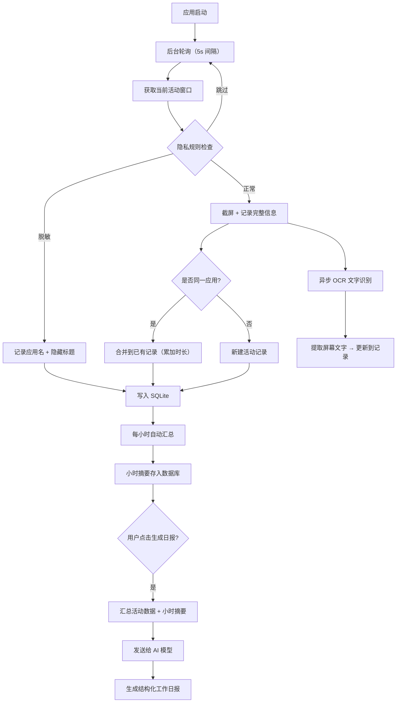

<p align="center">
  
</p>

<h1 align="center">Work Review</h1>

<p align="center">
  <b>今天用了什么应用？浏览了哪些网页？AI 帮你总结一天的工作。</b>
</p>

<p align="center">
  <a href="https://github.com/wm94i/Work_Review/releases/latest">
    
  </a>
  
  
</p>

---

## 为什么做这个？

每天在电脑前忙了一整天，到了写日报或回顾时却想不起来具体做了什么。

Work Review 就是为了解决这个问题——**它安静地运行在后台，帮你自动记录一天中使用了哪些应用、浏览了哪些网页、在每个应用上花了多少时间**，最后还能用 AI 帮你生成一份工作总结。

---

## 它能帮你做什么？

| 功能 | 说明 |
|------|------|
| 📱 **应用使用记录** | 自动追踪你打开了哪些应用、用了多久 |
| 🌐 **网页浏览记录** | 记录你在浏览器中访问过的网站 |
| ⏱️ **时间线回放** | 按时间顺序查看一天的完整工作轨迹 |
| 📊 **可视化统计** | 图表展示时间分布，一眼看出时间花在哪了 |
| 🤖 **AI 工作总结** | 基于你的活动数据，自动生成当日工作回顾 |

---

## 技术流程



**数据流向：** 活动窗口 → 截屏/OCR → SQLite → 小时摘要 → AI 日报

---

## AI 在这里做什么？

Work Review 的核心是**自动记录**，AI 是锦上添花的总结工具。

**简单说：数据是应用自己收集的，AI 只负责最后一步——把碎片化的活动数据整理成一份人类可读的工作日报。**

> 不想用 AI？完全没问题。记录、时间线、图表统计这些核心功能不依赖 AI，开箱即用。

### AI 模式选择

| 模式 | 说明 | 隐私 |
|------|------|------|
| **本地模式** | 使用 [Ollama](https://ollama.com) 本地大模型 | ⭐⭐⭐ 数据完全不出本机 |
| **云端模式** | 将活动摘要发送到你配置的 API | ⭐⭐ 仅上传统计摘要 |

支持的 API 服务：Ollama、OpenAI、DeepSeek、通义千问、硅基流动、智谱、Kimi、豆包、Gemini、Claude 等。

---

## 下载安装

从 [Releases](https://github.com/wm94i/Work_Review/releases/latest) 页面下载最新版本：

| 平台 | 下载 |
|------|------|
| macOS (Apple Silicon) | `.dmg` |
| macOS (Intel) | `.dmg` |
| Windows | `.exe` |

### macOS 首次打开

由于应用未做代码签名，首次打开可能提示「已损坏」。执行以下命令即可：

```bash
sudo xattr -rd com.apple.quarantine /Applications/Work\ Review.app
```

然后前往 **系统设置 → 隐私与安全性 → 屏幕录制**，勾选 Work Review。

---

## 使用方式

1. **安装并打开应用**，授权所需权限后，应用会自动在后台开始记录
2. **正常工作**，不需要手动操作任何东西
3. **随时查看**概览页面，了解今天的时间分布和应用使用情况
4. **查看时间线**，回顾一天中每个时段做了什么
5. **生成 AI 总结**（可选），一键获取当天工作的结构化回顾报告

---

## 隐私说明

- **所有数据存储在本地**，不会上传到任何服务器
- 支持设定**应用规则**（跳过、模糊某些应用的记录）
- 支持**敏感关键词过滤**和**域名黑名单**
- 锁屏时自动暂停记录

---

## 技术栈

| 组件 | 技术 |
|------|------|
| 后端 | Rust + Tauri 2 |
| 前端 | Svelte 4 + TailwindCSS |
| 数据库 | SQLite（本地） |

---

## 许可证

MIT License
