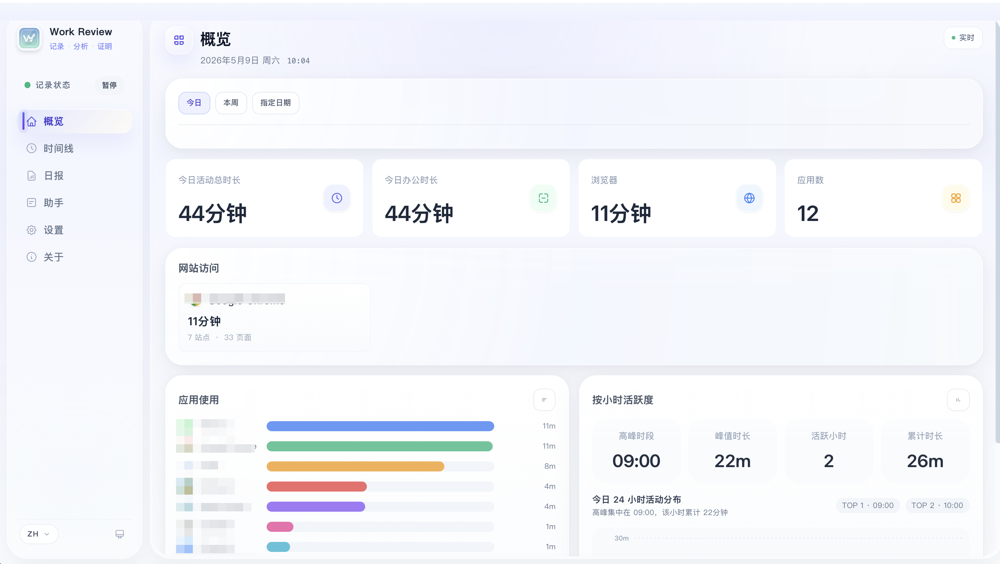
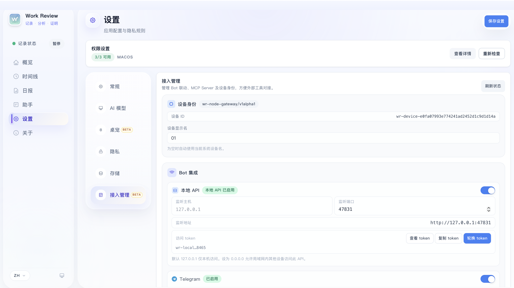

<p align="center">
  
</p>

<h1 align="center">Work Review</h1>

<p align="center">
  <strong>面向个人使用的本地工作轨迹记录器。</strong>
</p>

<p align="center">
  <a href="./README.md">中文</a> · <a href="./README.tw.md">繁體中文</a> · <a href="./README.en.md">English</a>
</p>

<p align="center">
  <a href="https://github.com/wm94i/Work_Review/releases/latest">
    
  </a>
  
  
  
</p>

---

Work Review 会在后台持续记录你当天使用过的应用、访问过的网站、关键窗口和屏幕内容，再把这些离散片段整理成一条**可回看、可追问、可复盘**的工作轨迹。

- 不需要手动打卡，也不用事后回忆今天干了什么
- 概览、时间线、日报、工作助手共用同一份底层记录
- 既能看统计，也能直接追到具体页面、窗口标题和上下文截图
- 支持多段工作时间设置、按域名修改语义分类、按小时活跃度视图
- 支持轻量模式、日报 Markdown 导出和多屏截图策略
- `桌面化身 Beta`：轻量桌宠状态反馈，陪你工作

> 全部数据本地存储，不上传任何服务器。AI 功能可选，关掉也完全可用。

---

## 这是什么

它不是传统意义上的考勤工具，也不是只会堆数字的时间统计器。

Work Review 更像一套面向个人的工作留痕系统：

- 自动沉淀工作轨迹：应用、网站、截图、OCR、时段摘要都会被串起来
- 快速回答工作问题：一句“今天做了什么”“这周主要在推进什么”就能直接得到结果
- 为复盘而不是监控设计：重点是帮助你回忆、整理、复用，而不是制造额外负担

---

## 核心能力

### 自动记录

| 记录维度 | 说明 |
|---------|------|
| 应用追踪 | 自动识别前台应用，记录使用时长、窗口标题和分类 |
| 网站追踪 | 识别浏览器 URL，按浏览器 / 站点 / 页面聚合浏览记录 |
| 屏幕留痕 | 定时截图并提取 OCR 文本，支持按活动窗口所在屏幕或整桌面拼接截图 |
| 空闲检测 | 键鼠 + 屏幕双重判断，尽量避免挂机时间被误记为工作 |
| 历史回看 | 通过时间线回放当日轨迹，定位具体时段与上下文 |

### 智能分析

| 能力 | 说明 |
|-----|------|
| 工作助手 | 基于你的真实记录做问答，适合回答“今天做了什么”“最近在推进什么” |
| 时间范围识别 | 自动理解“昨天”“本周”“最近 3 天”等自然语言时间范围 |
| Session 聚合 | 把碎片活动整理为连续工作段，更容易看出完整工作节奏 |
| 待办提取 | 从访问页面、窗口标题和上下文里提炼可能的后续事项 |
| 日报生成 | 结构化日报，支持历史回看、按小时活跃度摘要、Markdown 导出和 AI 附加提示词 |
| 双模式回答 | 可选基础模板或 AI 增强，兼顾零配置和表达质量 |
| 网站语义标记 | 在概览页点击浏览器域名，可修改其语义分类（如标记为「休息娱乐」则不计入工作时长），修改后自动回填历史记录 |
| 多段工作时间 | 支持设置多个工作时段（如上午 + 下午），休息时间不计入工作时长 |
| 桌面化身 Beta（持续完善中） | 用独立桌宠窗口反馈待机 / 办公 / 阅读 / 会议 / 音乐 / 视频 / 生成中等状态，当前仍在持续补齐交互与预设细节 |

### Bot 联动 Beta（Telegram / 飞书）

- 支持通过本地 API + 多设备注册，从 Telegram / 飞书远程查询与生成日报
- 支持命令：`/devices`、`/device`、`/reports`、`/report`、`/generate`（飞书同样支持中文关键词）
- 仅限个人和本人多设备联动使用，不得用于员工监控、绩效考核或隐形追踪

### MCP Server Beta

通过 stdio 协议将工作记录接入 AI 编码工具，支持查询时间线、生成日报、分析工作模式等。

- 内置 11 个工具（时间线查询、日报生成、工作会话分析等）、3 个资源、3 个提示词模板
- 内置 5 个技能（每日回顾、每周总结、项目时间审计、工作模式分析、专注会话建议），通过 `execute_skill` 触发
- 带策略引擎，自动过滤隐私应用和脱敏内容

<details>
<summary>配置方法</summary>

需要先从源码编译 MCP Server（后续会随应用一起分发）：

```bash
cargo build --release -p work-review-mcp-server
# 二进制位于 target/release/work-review-mcp-server
```

以下为常见工具的配置参考，JSON 格式基本一致，按各自工具的配置入口添加即可：

```json
{
  "mcpServers": {
    "work-review": {
      "command": "/path/to/work-review-mcp-server",
      "args": [],
      "env": {
        "WORK_REVIEW_DB_PATH": "/path/to/work_review.db",
        "WORK_REVIEW_CONFIG_PATH": "/path/to/config.json"
      }
    }
  }
}
```

| 工具 | 配置位置 | 作用域 |
|------|----------|--------|
| Claude Code | `~/.claude/settings.json` | 全局 |
| Cursor | Settings > MCP 或 `.cursor/mcp.json` | 全局 / 项目级 |
| VS Code (Copilot) | `.vscode/mcp.json`（`servers` 字段，需加 `"type": "stdio"`） | 项目级 |

> 如果不设置环境变量，默认使用系统数据目录下的数据库和配置文件。

</details>

### 隐私控制

- 按应用设置 `正常 / 脱敏 / 忽略`
- 敏感关键词自动过滤
- 域名黑名单
- 锁屏自动暂停
- 手动暂停 / 恢复

### 使用控制

- 支持轻量模式：关闭主界面后可释放主 Webview，仅保留后台记录和托盘
- 支持在时间线内直接修改应用默认分类，并回填该应用的历史记录
- 支持迁移本地数据目录，并在迁移后清理旧目录中的应用托管数据

---

## 界面预览

先看界面，再看能力，会更容易建立对产品的整体认知。

### 今日概览



概览页会把当天的总时长、办公时长、浏览器使用、网站访问、按小时活跃度和应用分布放在同一屏里，适合先快速判断今天的工作重心。

### 工作助手


助手页直接基于你的本地记录回答问题，适合拿来做当天回顾、阶段总结和待办梳理。

### 接入管理 Beta



接入管理页用于管理设备身份、本地 API、Bot 联动和 MCP Server，方便外部工具对接和多设备日报生成。

### 桌面化身 Beta


桌面化身会以独立桌宠的形式悬浮在桌面上，用轻量状态和短气泡反馈当前节奏。它更适合做陪伴式感知，而不是信息面板。

- 支持待机、办公、阅读、开会、听歌、视频、生成中、摸鱼等状态
- 支持桌宠大小与猫体透明度调节
- 当前仍处于 `Beta` 阶段，会继续优化切换速度、交互联动、表情和视觉细节

---

## 页面结构

| 页面 | 做什么 |
|------|-------|
| **概览** | 聚合今天的总时长、办公时长、浏览器时长、网站访问、按小时活跃度和应用分布 |
| **时间线** | 逐时段回看窗口、截图、OCR 文本和页面访问轨迹，并可修正应用分类 |
| **助手** | 用自然语言直接提问，基于本地记录回答工作问题 |
| **日报** | 查看、生成和回看任意日期的日报，支持附加提示词和 Markdown 导出 |
| **设置** | 管理记录策略、模型、隐私规则、桌面化身、轻量模式、存储位置和更新行为 |

---

## AI 模型

Work Review 的核心始终是**本地记录**，AI 的作用是把这些记录变得更容易阅读、搜索和复盘。

| 模式 | 说明 |
|------|------|
| **基础模板** | 零配置即可使用，直接输出稳定的结构化结果 |
| **AI 增强** | 调用你自己的模型服务，让总结、问答和复盘更自然 |

支持的提供商：Ollama (本地) / OpenAI 兼容 / DeepSeek / 通义千问 / 智谱 / Kimi / 豆包 / MiniMax / SiliconFlow / Gemini / Claude

> 不启用 AI 时，记录、概览、时间线、工作助手（基础模式）和基础模板日报全部正常可用。

> 日报附加提示词仅在 `AI 增强` 模式下生效。

> `Ollama` 提供商支持直接刷新本机模型列表；如果模型未出现在下拉列表中，仍可手动输入模型名称。

---

## 安装

从 [Releases](https://github.com/wm94i/Work_Review/releases/latest) 下载最新版。

| 平台 | 安装包 |
|------|--------|
| macOS Apple Silicon | `.dmg` |
| macOS Intel | `.dmg` |
| Windows | `.exe` |
| Linux (X11 / 主流 Wayland) | `.deb` / `.AppImage` |

- `Windows`：截图和桌宠联动默认不需要额外系统隐私授权；安装时依赖 Microsoft Edge WebView2 Runtime（若下载链路受限，可手动安装后重试）。
- `Linux`：通常不需要额外系统隐私授权，但截图和桌宠联动依赖当前会话类型与 provider / 工具链是否齐全。
- `macOS`：时间线截图需要 `屏幕录制`，桌宠键鼠联动需要 `辅助功能 + 输入监控`。

<details>
<summary>Linux 依赖</summary>

基础依赖：

```bash
sudo apt install xprintidle tesseract-ocr
```

X11 额外依赖：

```bash
sudo apt install xdotool x11-utils
```

X11 截图工具（至少安装一个）：

```bash
sudo apt install scrot        # 推荐
# 或替代方案：
sudo apt install maim          # 轻量替代
sudo apt install imagemagick   # 提供 import 命令
```

Wayland 常见 provider / 工具：

```bash
# GNOME
gdbus                                # 通常随系统提供
# 桌宠键鼠联动还需要安装仓库内 GNOME Shell 扩展：
# scripts/gnome-shell/work-review-avatar-input@workreview.app

# KDE Plasma
kdotool

# Sway
swaymsg

# Hyprland
hyprctl

# Wayland 截图工具（至少安装一个）
grim / gnome-screenshot / spectacle
```

> **说明：** `loginctl`、`dbus-send`、`pgrep` 在多数发行版中已预装。
> Linux 当前支持 `X11` 以及主流 `Wayland` provider 链（GNOME / KDE Plasma / Sway / Hyprland）。

**Wayland 注意事项：**

- 支持 `sudo` 运行（会自动恢复 Wayland/DBus 环境变量）。推荐优先以普通用户运行；如因数据目录权限等原因需使用 `sudo`，截图和窗口追踪仍可正常工作。
- 如遇 `--no-sandbox` 提示，使用 `Work_Review --no-sandbox` 或 `sudo Work_Review --no-sandbox`。
> Linux 下浏览器 URL 已恢复为**最佳努力链路**：
> Firefox / Zen / LibreWolf / Waterfox 优先走 sessionstore；
> Chromium 系仍主要依赖窗口标题提取与最近记录兜底，不等同于 macOS 的强能力采集。

</details>

<details>
<summary>macOS 首次打开提示"已损坏"？</summary>

```bash
sudo xattr -rd com.apple.quarantine "/Applications/Work Review.app"
```

然后到 `系统设置 > 隐私与安全性` 检查以下权限：

- `屏幕录制`：时间线截图必需
- `辅助功能`：读取前台窗口状态必需
- `输入监控`：桌宠键盘和鼠标联动必需

如果刚安装新版本后发现截图突然没有了，或者桌宠不再响应键鼠，先确认这些权限仍然指向当前这份 `Work Review.app`。
</details>

---

## 技术栈

| 层级 | 技术 |
|------|------|
| 桌面框架 | Tauri 2 |
| 后端 | Rust |
| 前端 | Svelte 4 + Vite |
| 样式 | Tailwind CSS |
| 存储 | SQLite |

---

## 开发

```bash
npm install
npm run tauri:dev    # 开发
npm run tauri:build  # 构建
```

要求：Node.js 18+ / Rust stable / Tauri 2 CLI

```text
src/                  Svelte 前端
src/routes/           页面（概览 / 时间线 / 问答 / 日报 / 设置）
src/lib/              组件、store、工具函数
src-tauri/src/        Rust 后端（监控、数据库、分析、隐私、更新）
```

---

## 相关文档

- [CHANGELOG.md](CHANGELOG.md)
- [docs/WINDOWS_OCR.md](docs/WINDOWS_OCR.md)

## 社区交流

欢迎来吐槽使用体验。

### 微信群

<p align="center">
  
</p>

> 若群二维码失效，可先关注下方公众号，再按公众号内指引进群。

### 公众号

<p align="center">
  
</p>

> 微信群二维码失效时，可通过公众号获取最新进群方式。

### Telegram

[](https://t.me/+stYJLlkZbDYwM2Rl)

## 致谢

- 感谢 [linux.do](https://linux.do/) 社区的交流与讨论支持。
- 桌面化身中的 BongoCat 交互资源与部分视觉素材改编自 [ayangweb/BongoCat](https://github.com/ayangweb/BongoCat)，上游项目采用 MIT License。相关归属与许可说明见 [THIRD_PARTY_NOTICES.md](THIRD_PARTY_NOTICES.md)。

## License

MIT

---

## 历史星标

<a href="https://www.star-history.com/#wm94i/Work_Review&Date">
  <picture>
    <source
      media="(prefers-color-scheme: dark)"
      srcset="https://api.star-history.com/svg?repos=wm94i/Work_Review&type=Date&theme=dark"
    />
    <source
      media="(prefers-color-scheme: light)"
      srcset="https://api.star-history.com/svg?repos=wm94i/Work_Review&type=Date"
    />
    
  </picture>
</a>
